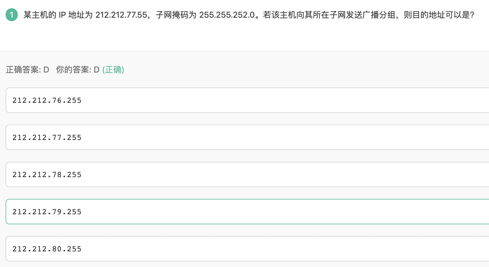

## 计算机网络


> 10.100.21.0/24,10.100.22.0/24,10.100.23.0/24 
>
> 21:00010101
>
> 22:00010110
>
> 23:00010111
>
> 变化的只有后两位, --> 网络前缀 = 8 + 8 + 6 = 22 --> 000101 = 20 -> 10.100.20/22



主机号全为1，为广播地址，主机号：子网掩码的后几位

## JS


> A选项：Symbol确保唯一，即使采用相同的名称，也会产生不同的值。a 与 b 并不会相等。
>
> B选项： 无法确定对象是否是proxy对象（透明虚拟化）👉https://exploringjs.com/es6/ch_proxies.html#sec_proxies-explained
>
> C选项： 括号匹配项是无限的, 但是RegExp对象能捕获的只有九个👉https://developer.mozilla.org/zh-CN/docs/Web/JavaScript/Reference/Global_Objects/RegExp/n
>
> D：火狐、safari、谷歌和Opera浏览器都给函数定义了一个非标准的name属性，通过这个属性可以访问到给函数指定的名字，匿名函数的name属性是空字符串


### js全局函数


## 


### 变量提升


以上代码相当于

```
function(){
	var a;
	console.log(a);//undefind
	a=5;
	console.log(window.a);//10
	a=20;
	console.log(a)//20
}
```

因为函数内也声明了变量a，声明提升

**setInterval是每隔一段时间调用一次方法**


### 模板字符串-[标签模板](https://es6.ruanyifeng.com/#docs/string#%E6%A0%87%E7%AD%BE%E6%A8%A1%E6%9D%BF)


模板字符串可以紧跟在一个函数名后，若模板中有变量，会将模板字符串处理成多个参数再调用函数。

## 操作系统：


## CSS


padding值为百分比时，其值是基于**其父元素的宽度**（width，不包含padding和border）来定义的,200*10%=20px


fixed不是默认值。