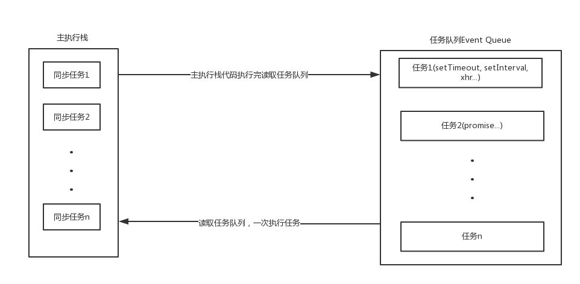
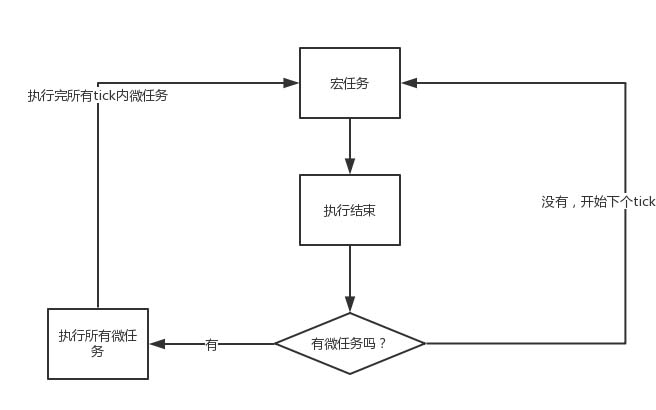

### [事件循环机制](https://www.cnblogs.com/yugege/p/9598265.html)

同步和异步任务(ajax/settimeout)分别进入不同的执行环境，同步的进入主线程，即主执行栈，异步的进入 Event Queue 。主线程内的任务执行完毕为空，会去 Event Queue 读取对应的任务，推入主线程执行。 

1. 执行同步任务,异步任务放入任务队列

2. 任务队列中有宏任务和微任务,执行红任务,检测是否有微任务,执行所有微任务

3. 下一轮

宏任务:script整体代码 、setTimeout/Interval/Immdediate 、uirender、i/o

微任务:process.nextTick /promise.then(async await) /Mutation Observer /Object.observe 

**先执行同步代码，遇到异步宏任务则将异步宏任务放入宏任务队列中，遇到异步微任务则将异步微任务放入微任务队列中，当所有同步代码执行完毕后，再将异步微任务从队列中调入主线程执行，若在执行过程中产生新的微任务则继续执行微任务，微任务执行完毕后再将异步宏任务从队列中调入主线程执行，一直循环直至所有任务执行完毕。**

new Promise在实例化的过程中所执行的代码都是同步进行的

参考链接：

[宏任务微任务](https://blog.csdn.net/weixin_42420703/article/details/82790942)

