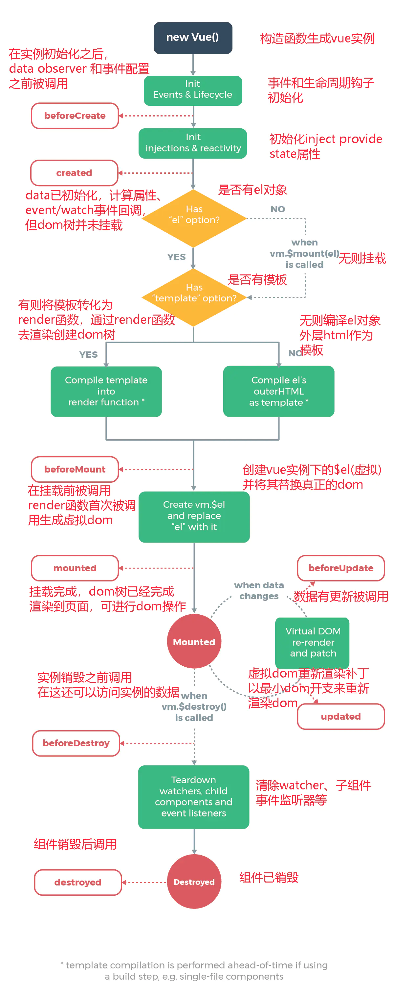

# vue的生命周期

每个Vue实例在被创建时都要经过一系列的初始化过程，同时在这个过程中也会运行一些叫做生命周期钩子的函数，这给了用户在不同阶段添加自己的代码的机会。

生命周期钩子的this上下文指向调用它的实例函数。

注意：不要在选项或回调上使用箭头函数，比如`created: () => console.log(this.a)`或`vm.$watch('a',newValue => this.myMethod())`。因为箭头函数并没有this，经常导致一些错误。

## Vue3生命周期

下表包含如何在 [setup ()](https://v3.cn.vuejs.org/guide/composition-api-setup.html) 内部调用生命周期钩子：

| 选项式 API        | Hook inside `setup` |
| ----------------- | ------------------- |
| `beforeCreate`    | Not needed*         |
| `created`         | Not needed*         |
| `beforeMount`     | `onBeforeMount`     |
| `mounted`         | `onMounted`         |
| `beforeUpdate`    | `onBeforeUpdate`    |
| `updated`         | `onUpdated`         |
| `beforeUnmount`   | `onBeforeUnmount`   |
| `unmounted`       | `onUnmounted`       |
| `errorCaptured`   | `onErrorCaptured`   |
| `renderTracked`   | `onRenderTracked`   |
| `renderTriggered` | `onRenderTriggered` |
| `activated`       | `onActivated`       |
| `deactivated`     | `onDeactivated`     |

## vue2生命周期

