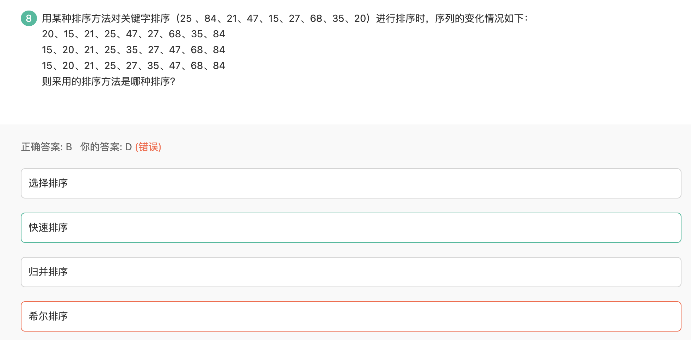

### 堆排序

### 二路归并排序

### 单链表的排序

1. 使用快慢指针找到中间节点
2. 使用归并排序

### 快速排序

1. 从数列中挑出一个元素，称为 "基准"（pivot）;
2. 重新排序数列，所有元素比基准值小的摆放在基准前面，所有元素比基准值大的摆在基准的后面（相同的数可以到任一边）。在这个分区退出之后，该基准就处于数列的中间位置。这个称为分区（partition）操作；
3. 递归地（recursive）把小于基准值元素的子数列和大于基准值元素的子数列排序；

## 选择排序

每一轮挑出一个最小的

## 插入排序

从第二个元素开始，将这个元素插入到前面已经有序的数组中，插入方式是和前一个相比较，如果比它小，就交换两个元素，继续比较，直到找到比较大的或者第一个。

时间复杂度：N2

空间复杂度：1

## 冒泡排序

前一个跟后一个比，不符合升序就交换，跳出条件是一轮遍历中未发生过交换。

希尔排序：对插入排序的优化
