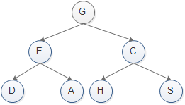

# 有哪些数据结构?


## 数组

数组是将相同类型的元素存储于**连续内存空间**的数据结构，其长度不可变。

注:java中有普通数组和可变数组,以下是它的不同实现

```java
//普通数组,长度不可变
int[] array = new int[5];
array[0] = 2;
int[] array = {2,3,1,0,2};
//可变数组,基于数组和扩容机制实现
List<Integer> array = new ArrayList<>();
array.add(2);
```

## 链表

链表以节点为单位，每个元素都是一个独立对象，在内存空间的**存储是非连续**的。链表的节点对象具有两个成员变量：「值 `val`」，「后继节点引用 `next`」 。

```java
class ListNode {
    int val;       // 节点值
    ListNode next; // 后继节点引用
    ListNode(int x) { val = x; }
}
```

## 栈(先入后出)

js中,使用数组方法push()和pop()实现

## 队列(先入先出)

js中,使用数组方法push()和shift()

## 树

根据子节点数量分为「二叉树」和「多叉树」

以二叉树为例,每个节点包含三个成员变量:「值 `val`」、「左子节点 `left`」、「右子节点 `right`」 

```java
class TreeNode {
    int val;        // 节点值
    TreeNode left;  // 左子节点
    TreeNode right; // 右子节点
    TreeNode(int x) { val = x; }
}
```

### [二叉树的遍历](https://www.cnblogs.com/vipchenwei/p/7562567.html)



先序遍历：根节点->左节点->右节点，GEDACHS

中序遍历：左节点->根节点->右节点，DEAGHCS

后序遍历：左节点->右节点->根节点，DAEHSCG

## 堆

堆是一种基于「完全二叉树」的数据结构

### 二叉树的最大深度

```
//递归解法

var maxDepth = function (root) {

  if (!root) return 0;

  return 1 + Math.max(maxDepth(root.left), maxDepth(root.right));

}

//非递归解法

var maxDepth = function (root) {

  if (!root) return 0;

  let res = 0;

  const queue = [root];

  while (queue.lenth) {

    let levNum = queue.length;

    res++;

    while (levNum--) {

      let node = queue.shift();

      if (!node.left) queue.push(node.left);

      if (!node.right) queue.push(node.right);

    }

  }

  return res;

}
```

### 回文数字

### [最长递增子序列](https://leetcode-cn.com/problems/longest-increasing-subsequence/)

贪心算法+二分查找

```js
var lengthOfLIS = function (nums) {
  if (nums.length == 1) return 1;

  let end = 0;
  let greedy = [];
  greedy[0] = nums[0];
  for (let i = 1; i < nums.length; i++) {
    if (greedy[end] < nums[i]) {
      greedy[end + 1] = nums[i];
      end++;
    } else {
      let left = 0;
      let right = end;
      while (left < right) {
        let mid = left + parseInt((right - left) / 2);
        //二分查找
        //注意此处的条件 不能写错
        if (nums[i] <= greedy[mid]) {
          right = mid;
        } else {
          left = mid + 1;
        }
      }
      greedy[left] = nums[i];
    }
  }
  return end + 1;
};
```


### [用两个栈实现队列](https://leetcode-cn.com/problems/yong-liang-ge-zhan-shi-xian-dui-lie-lcof/solution/mian-shi-ti-09-yong-liang-ge-zhan-shi-xian-dui-l-3/)

#### 方法:双栈

维护两个栈,第一个栈支持插入操作,第二个栈支持删除操作

- 如果 stack2 为空，则将 stack1 里的所有元素弹出插入到 stack2 里
- 如果 stack2 仍为空，则返回 -1，否则从 stack2 弹出一个元素并返回

```js
var CQueue = function () {
  this.stack1 = [];
  this.stack2 = [];
};

CQueue.prototype.appendTail = function (value) {
  this.stack1.push(value);
};

CQueue.prototype.deleteHead = function () {
  if (this.stack2.length === 0) {
    if (this.stack1.length === 0) {
      return -1;
    }
    //改进:将for循环改为while
    while (this.stack1.length) {
      //先存储tail再push会更快
      const tail = this.stack1.pop();
      this.stack2.push(tail);
    }
  }
  return this.stack2.pop();
};
```


### 两个链表的第一个重合交点

#### 方法一:双指针

```js
//双指针解法
//时间复杂度:m+n
//空间复杂度:1
const getIntersectionNode = (headA, headB) => {
  let pA = headA;
  let pB = headB;
  //判断其中一个链表为空则无交点
  if (headA === null || headB === null) {
    return null;
  }
  //如果链A与链B交点前等长,则会一起走到交点,跳出循环
  //如果交点前不等长,则pA走完链A后会走链B,pB走完链B后会走链A,然后相遇
  while (pA !== pB) {
    pA = pA === null ? headB : pA.next;
    pB = pB === null ? headA : pB.next;
  }
  return pA;
};
```

### 方法二: 哈希集合

将链接节点放入一个Set对象,使用Set对象的has()方法判断


