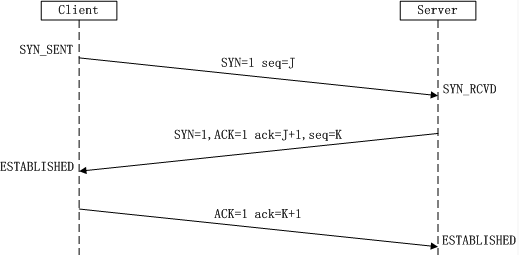
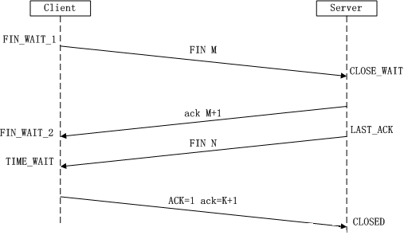
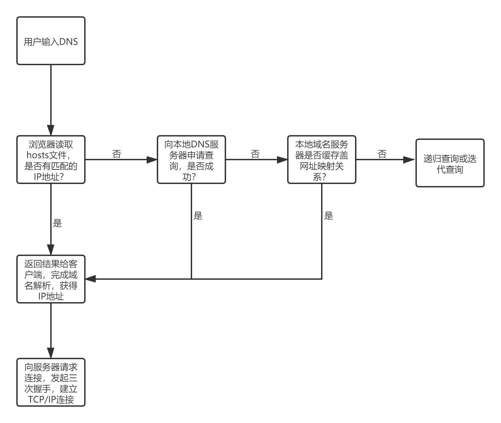
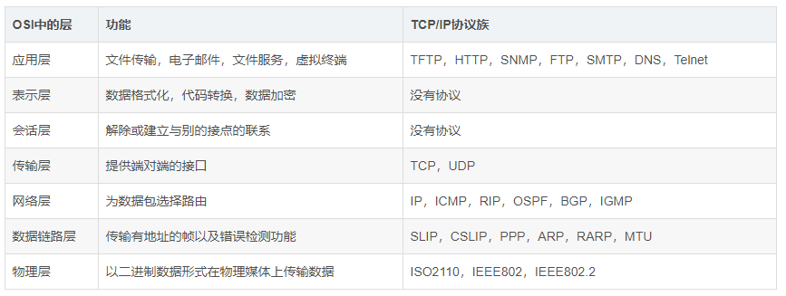

### TCP与UDP的区别：

1、TCP是**面向连接**的，面向连接就是双方交换数据之前要先建立并确认连接。

UDP是**无连接**的，减少了开销和发送数据之前的时延。。如打电话与发邮件的例子。

2、TCP是**可靠**的，**有重传机制**，通过TCP连接传送的数据，无差错、不丢失、不重复、并且**按序到达**。UDP是不可靠的，不会进行重传。

3、TCP是**面向字节流**的，UDP是面向报文的，因此TCP**无界**，而UDP有界；

 TCP通过字节流传输，面向字节流的含义即 虽然应用程序和TCP的交互是一次一个大小不等的数据块，但TCP将应用程序交下来的数据看成是一连串的无结构的字节流。TCP并不知道所传送的字节流的含义。

UDP会保留应用层交下来的报文的边界，一次交付一个完整的报文。

4、TCP**有序**，UDP无序；

 消息在传输过程中可能会乱序，后发送的消息可能会先到达，TCP会对其进行重排序，UDP不会。

5、TCP有**流量控制**（拥塞控制），UDP没有流量控制，更适合媒体通信。TCP利用滑动窗口机制控制发送方的速度，更对方给出的窗口值和当前网络拥塞的程度决定一个报文段应该包含多少个字节。以免接收方来不及接收，造成数据的丢失。UDP则不会。

 拥塞控制：防止过多的数据注入到网络中，使网络中的路由器或链路不致过载。

6、TCP**首部开销(**20个字节)比UDP的首部开销(8个字节)要大

 7、

#### TCP字节流和UDP数据报区别

两者的区别在于TCP接收的是一堆数据，而每次取多少由主机决定;而UDP发的是数据报，客户发送多少就接收多少。

TCP中的流指的是流入到进程或从进程流出的字节序列。

### TCP的三次握手：(我要和你建立链接，你真的要和我建立链接么，我真的要和你建立链接，成功)

第一次握手：Client将标志位SYN置为1，随机产生一个值seq=J，并将该数据包发送给Server，Client进入SYN_SENT状态，等待Server确认。

第二次握手：Server收到数据包后由标志位SYN=1知道Client请求建立连接，Server将标志位SYN和ACK都置为1，ack=J+1，随机产生一个值seq=K，并将该数据包发送给Client以确认连接请求，Server进入SYN_RCVD状态。

第三次握手：Client收到确认后，检查ack是否为J+1，ACK是否为1，如果正确则将标志位ACK置为1，ack=K+1，并将该数据包发送给Server，Server检查ack是否为K+1，ACK是否为1，如果正确则连接建立成功，Client和Server进入ESTABLISHED状态，完成三次握手，随后Client与Server之间可以开始传输数据了。

ACK (Acknowledge character）即是确认字符，在数据通信中，接收站发给发送站的一种传输类控制字符。表示发来的数据已确认接收无误。

### 为什么TCP连接需要三次握手，两次不可以么?

为了防止 已失效的链接请求报文突然又传送到了服务端，因而产生错误。

客户端发出的连接请求报文并未丢失，而是在某个网络节点长时间滞留了，以致延误到链接释放以后的某个时间才到达Server。

这时，Server误以为这是Client发出的一个新的链接请求，于是就向客户端发送确认数据包，同意建立链接。若不采用“三次握手”，那么只要Server发出确认数据包，新的链接就建立了。

由于client此时并未发出建立链接的请求，所以其不会理睬Server的确认，也不与Server通信；

而这时Server一直在等待Client的请求，这样Server就白白浪费了一定的资源。

若采用“三次握手”，在这种情况下，由于Server端没有收到来自客户端的确认，则就会知道Client并没有要求建立请求，就不会建立链接。（但是Server会不停发送确认包，这也是SYN洪水攻击的原因。）

### 四次挥手：(我要和你断开链接；好的，断吧。我也要和你断开链接；好的，断吧)：

第一次挥手：Client发送一个FIN，用来关闭Client到Server的数据传送，Client进入FIN_WAIT_1状态。

 

第二次挥手：Server收到FIN后，发送一个ACK给Client，确认序号为收到序号+1（与SYN相同，一个FIN占用一个序号），Server进入CLOSE_WAIT状态。此时TCP链接处于半关闭状态，即客户端已经没有要发送的数据了，但服务端若发送数据，则客户端仍要接收。

 

第三次挥手：Server发送一个FIN，用来关闭Server到Client的数据传送，Server进入LAST_ACK状态。

 

第四次挥手：Client收到FIN后，Client进入TIME_WAIT状态，接着发送一个ACK给Server，确认序号为收到序号+1，Server进入CLOSED状态，完成四次挥手。

### 关于域名和域名服务器

与IP地址一一对应，方便用户记忆与查询。

Hosts:记录常用域名及对应IP地址的文件。

DNS服务器：存放域名及对应IP地址，提供IP地址和域名之间的转换服务的服务器。

DNS（Domain Name System) 

安全：DNS污染和劫持。

DNS解析 ：一种服务。

### [HTTP状态码](https://blog.csdn.net/banana960531/article/details/85621865)

**200 OK：**正常处理并返回；

*203*:非授权信息.请求成功.但返回的meta信息不在原始服务器而是一个副本;

**204 No Content：**表示客户端发送给客户端的请求得到了成功处理，但在返回的响应报文中不含实体的主体部分（没有资源可以返回）；

**206 Patial Content：**表示客户端进行了范围请求，并且服务器成功执行了这部分的GET请求，响应报文中包含由Content-Range指定范围的实体内容。

**301 Moved Permanently：**永久性重定向，表示请求的资源被分配了新的URL，之后应使用更改的URL；

**302 Found：**临时性重定向，表示请求的资源被分配了新的URL，希望本次访问使用新的URL；

​    301与302的区别：前者是永久移动，后者是临时移动（之后可能还会更改URL）

**303 See Other：**表示请求的资源被分配了新的URL，应使用GET方法定向获取请求的资源；

   302与303的区别：后者明确表示客户端应当采用GET方式获取资源

**304 Not Modified**：表示客户端发送附带条件（是指采用GET方法的请求报文中包含if-Match、If-Modified-Since、If-None-Match、If-Range、If-Unmodified-Since中任一首部）的请求时，服务器端允许访问资源，但是请求为满足条件的情况下返回改状态码；

**307 Temporary Redirect：**临时重定向，与303有着相同的含义，307会遵照浏览器标准不会从POST变成GET；（不同浏览器可能会出现不同的情况）；

**400 Bad Request：**表示请求报文中存在语法错误；

**401 Unauthorized：**未经许可，需要通过HTTP认证；

**403 Forbidden：**服务器拒绝该次访问（访问权限出现问题）

**404 Not Found：**表示服务器上无法找到请求的资源，除此之外，也可以在服务器拒绝请求但不想给拒绝原因时使用；

**500 Inter Server Error：**表示服务器在执行请求时发生了错误，也有可能是web应用存在的bug或某些临时的错误时；

**503 Server Unavailable：**表示服务器暂时处于超负载或正在进行停机维护，无法处理请求；

### CSRF 跨站请求伪造

前提: 受害者与有CSRF漏洞的服务器建立会话,返回session并存在本地cookie之后,未登出服务器

过程: 

1. 受害者访问恶意网站,该网站包含向漏洞服务发起请求的操作并能够直接执行
2. 该网站携带cookie向目标服务器发送伪造请求,网站校验用户信息成功,造成损失

#### 如何防御CSRF

1. Token(秘密校验令牌) 用于身份验证

   原理: 由于用户验证信息存于cookie,因此要在请求上放入黑客不能伪造的信息,服务器对token内容进行验证

   - 将token放在http头部,可以一次性给所有该类请求加上token
   - 每一个表单嵌入服务器可以验证的伪随机数

2. Refer验证

   请求头中有一个字端refer,记录http请求的来源地址,验证refer值是否是自己的网站

### SQL注入(攻击代码在服务端运行)

一种代码注入技术,利用服务器**对用户的输入过滤不完整**的安全漏洞

通过SQL 拼接字符串 追加命令 导致SQL语义发生了变化

#### 如何防御SQL注入

1. 对用户输入实施严格过滤(检验类型/是否有转义字符)

2. 不自己构造SQL注入,参数化查询

   在需要填入数据的地方 使用参数给值 需访问数据库时服务器会自动转义

   由于服务器会缓存查询计划,参数化查询会更快

3. 使用ORM,将数据/命令转化为常用对象,提供接口

4. 将SQL语句替换为存储过程 预编译SQL

### XSS 跨站脚本攻击(攻击代码在浏览器运行)

#### 反射型XSS(非持久化的)

1. 攻击者构造带有攻击脚本的链接,引诱用户点击

2. 浏览器发送请求,服务器响应后,**将带有XSS代码的响应反射回浏览器解析**

3. 运行此XSS攻击代码,据此获取敏感信息

#### 存储型XSS(持久化的)

1. **攻击者将XSS攻击代码上传到服务器, 生成带攻击代码的页面**
2. 用户访问恶意页面 服务器响应请求 并**返回带有XSS攻击代码的页面**
3. 浏览器运行该页面 获取敏感信息

#### DOM型XSS

1. **构造带有攻击参数的恶意链接**
2. 用户点击后发出请求 服务器响应后
3. 浏览器运行网页中的脚本,**调用攻击参数** 获取敏感信息

#### 如何防御XSS

1. 对用户输入进行严格过滤
2. 对输入内容中的html进行转义 仅作为文本显示而不是作为代码解析
3. 输入净化 做encode处理

### HTTPS(HTTP 和 SSL/TLS 的组合)

提供对网络服务器身份鉴定及加密通讯

#### 握手过程

1. 客户端连接到服务器 要求创建安全连接

   发送“Client Hello” 发送支持的协议版本 加密套件 及客户端随机数(用于生成对称密钥)

2. 服务器发送“Server Hello” 决定加密套件

   确认使用的加密通信协议版本 (如果没有一致的版本则关闭通信)

   发送服务器随机数(用于生成对称密钥)与数字证书

3. 如果服务器需对客户端进行验证 则 客户端会发送证书 之后 客户端确认证书有效性

4. 生成会话密钥用于安全连接(**非对称加密**)

   会话密钥的两种实现方式:

   - (简单的公钥交换) 客户端随机生成主密钥,使用B的公钥加密随机生成的密钥,发给服务器,只有服务器才能揭秘

     任何一个步骤失败,握手过程即失败,断开所有的连接

   - (Diffie-Hellman交换) 服务器向客户端请求公钥,双方用对方公钥和自己的私钥计算出主密钥.

##### 为什么使用混合加密?

非对称加密开销大,计算量大.

对称加密需要安全交换主密钥.

